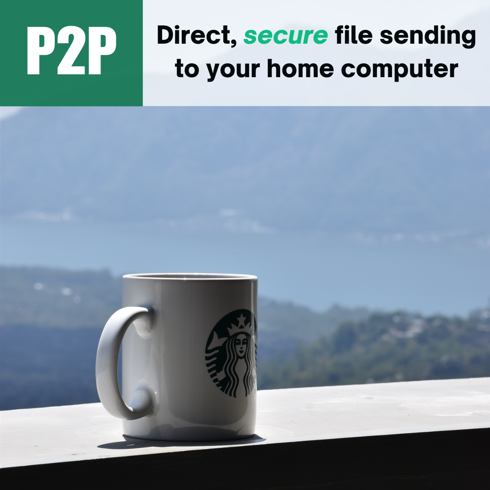
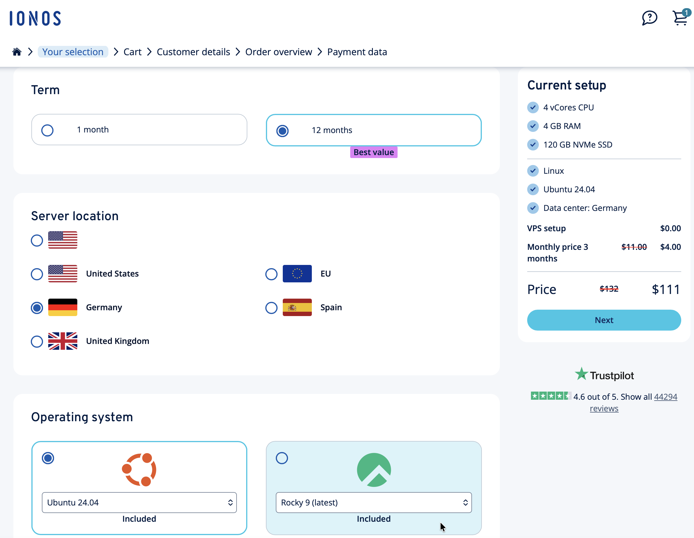
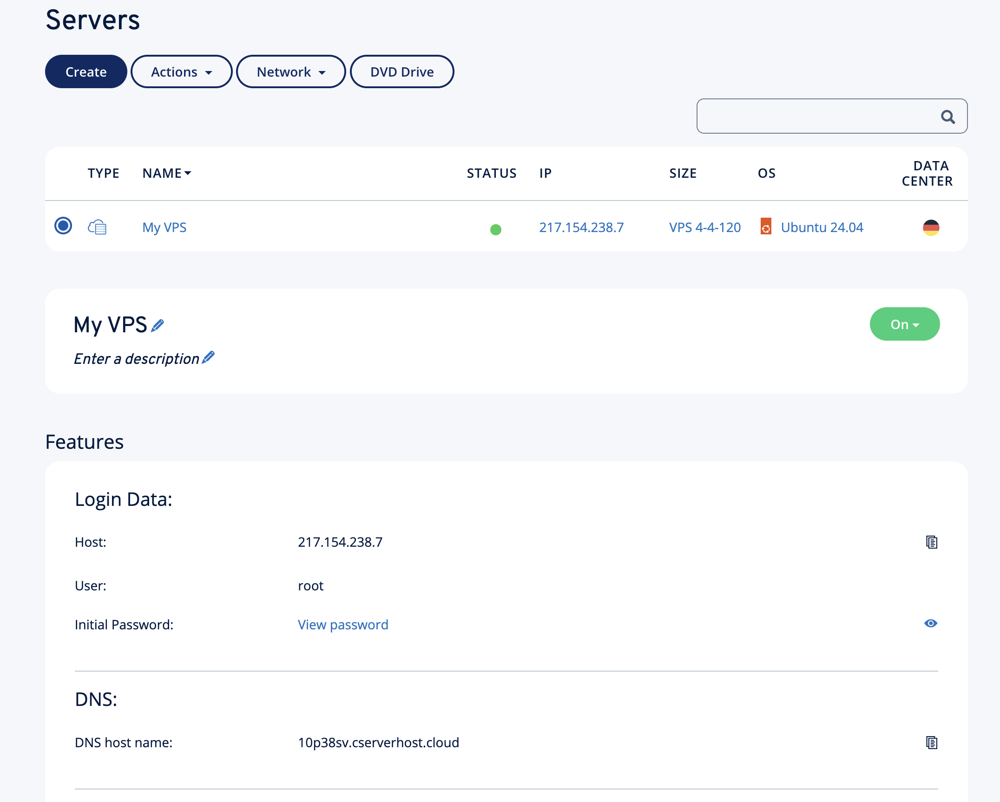
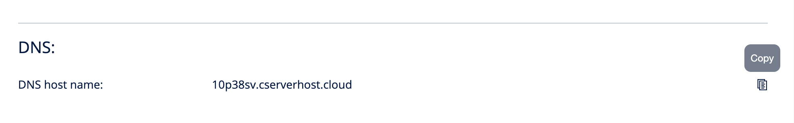
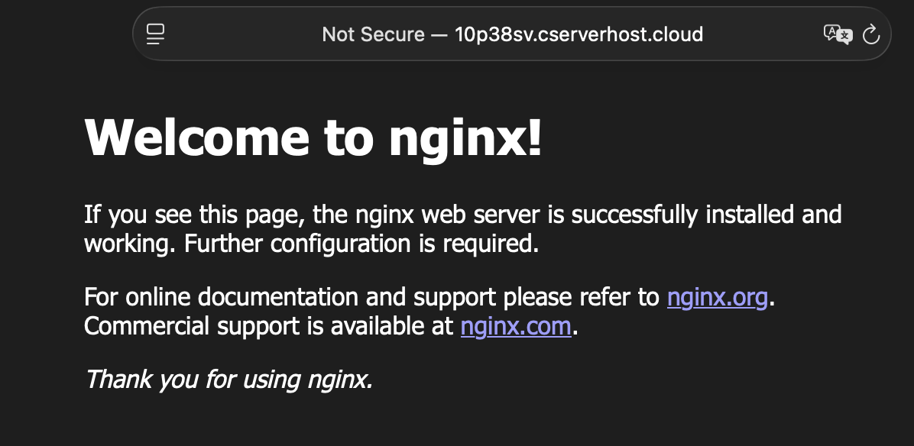
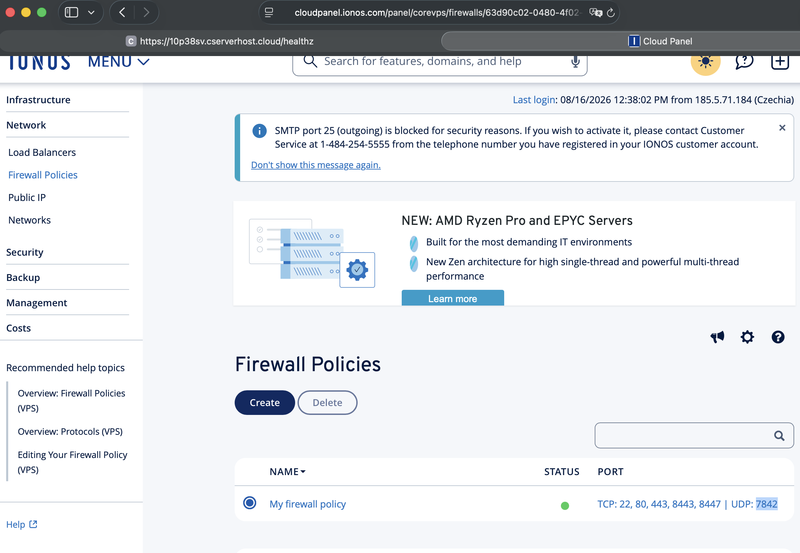
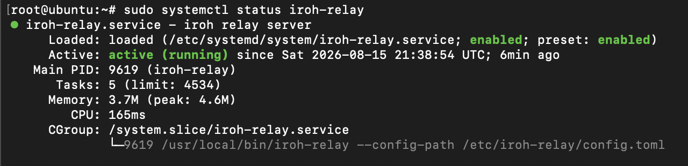
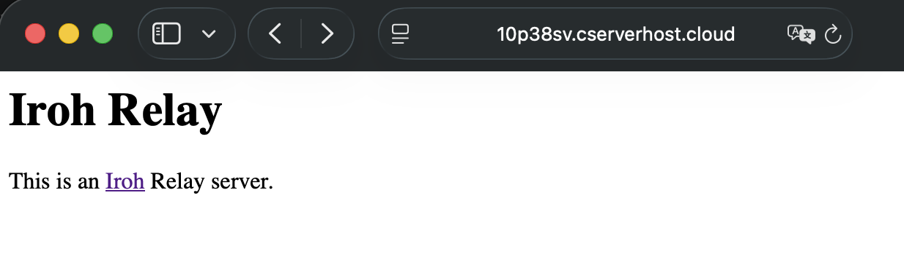
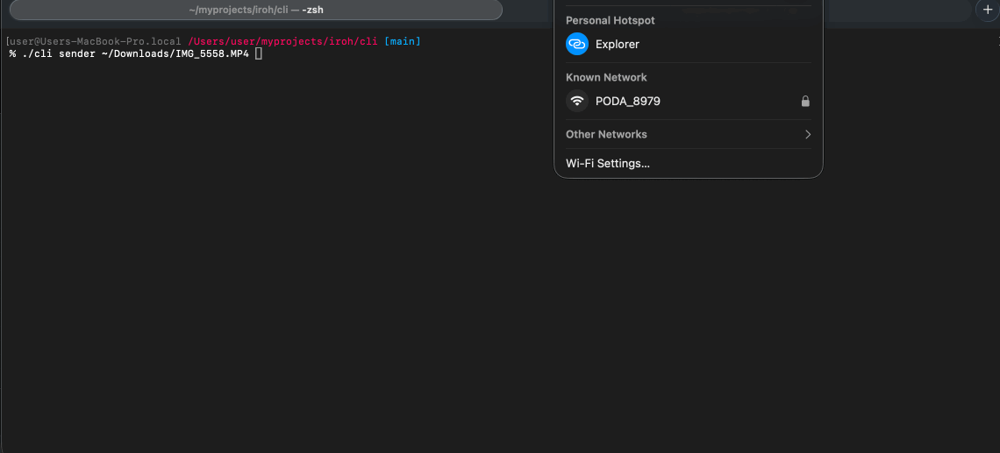

# P2P (iroh + VPS): Direct, secure transfer of your personal files when you are not home

<p align="center">
  
</p>


Getting a file off your home machine while you are travelling usually means
handing it to somebody else's cloud first. This project does not: the two
machines talk **directly** to each other over an encrypted QUIC connection, and
the only server involved is a small **relay you own**, which exists to introduce
the two peers to each other and to carry bytes only when a direct path cannot be
punched through NAT.

The repository has two halves:

1. **The relay** — a self-hosted [`iroh-relay`](https://github.com/n0-computer/iroh/tree/main/iroh-relay)
   on a modest VPS, locked to your own devices with a shared access token.
2. **The CLI** — a small Rust app that pushes a file or a whole folder from one
   machine to another through that relay.

## What you end up with

```
   Computer B (sender)                                  Computer A (receiver)
   mobile 5G, behind CGNAT                              home optic internet, behind a router
           │                                                     │
           │  1. discover + introduce                            │
           └──────────────►  your VPS: iroh-relay  ◄──────────────┘
                            443/TCP · 7842/UDP
                            (token-gated)
           │                                                     │
           │  2. direct QUIC, hole-punched, end-to-end encrypted │
           └─────────────────────────────────────────────────────┘
                       3. files land in ./downloads
```

The relay never sees plaintext — it only ever sees encrypted QUIC packets, and
only for as long as a direct path is unavailable. Once hole punching succeeds,
traffic leaves the relay entirely.

## Prerequisites

- A VPS you control (this walkthrough uses [IONOS](https://www.ionos.com/), but
  any provider works) with a DNS name pointing at it — Let's Encrypt issues the
  certificate against that name, so it must resolve before you start the relay.
- **Rust 1.85 or newer** on the VPS and on both client machines. The CLI is on
  edition 2024, which older toolchains will refuse to compile.
- Two machines on **different networks**. Two laptops on the same Wi-Fi will
  connect over the LAN and prove nothing about the relay.

---

## Part 1 — Create an Ubuntu server on IONOS hosting

<https://my.ionos.com/server-configuration>

- **Server location:** pick the region closest to you — every hole-punching
  handshake and every relayed byte pays that round trip.
- **Operating system:** Ubuntu.

```
4 vCores CPU
4 GB RAM
120 GB NVMe SSD
```

That is far more than a relay needs (it is a packet forwarder with no state to
speak of — the smallest instance on offer will do), but it leaves headroom if
you later run anything else on the box.



- Create the instance.



### Connect by SSH

```sh
ssh root@<your host IP>
```

### Create your main user

Working as `root` over SSH is the thing you are about to switch off, so make an
ordinary account first.

```sh
useradd -m -s /bin/bash boss
passwd boss
```

Grant root privileges:

```sh
usermod -aG sudo boss

# check assigned groups
groups boss
```

### Configure SSH access without using a password

Generate the key **on your local machine**, not on the server:

```sh
ssh-keygen -t ed25519 -f ~/.ssh/iroh-relay
```

Make your private key file read-only for you and unreadable to other users —
OpenSSH refuses to use a key with looser permissions:

```sh
chmod 400 ~/.ssh/iroh-relay
```

Put the public key on the server:

```sh
ssh-copy-id -i ~/.ssh/iroh-relay.pub boss@your_server_ip
```

Add an entry to `~/.ssh/config` on your local machine so the host, user and key
do not have to be retyped:

```sh
Host iroh-relay
  AddKeysToAgent yes
  HostName your_server_ip
  User boss
  IdentityFile ~/.ssh/iroh-relay
```

Try to connect:

```sh
ssh iroh-relay

# Or spell it out, without the config entry
ssh -i ~/.ssh/iroh-relay boss@your_server_ip
```

### Harden SSH

**Only after confirming the key login above works** — keep the current session
open while you do this, so a mistake does not lock you out.

Edit `/etc/ssh/sshd_config`:

```ini
PermitRootLogin no
PasswordAuthentication no
```

Then apply it:

```sh
sudo systemctl restart ssh
```

Now open a *second* terminal and log in again before closing the first one.

### Install nginx to test the new VPS from the browser (optional)

A quick way to prove DNS, routing and the provider firewall are sane before any
iroh-specific piece is in play.

```sh
sudo apt update
sudo apt install nginx -y
sudo systemctl enable --now nginx
```

- Copy the DNS host and open it in the browser.



You should see the nginx page if all is well.



Then remove it — it would otherwise hold port 80, which the relay needs for the
ACME challenge:

```sh
sudo systemctl disable --now nginx
sudo apt purge nginx nginx-common nginx-core -y
sudo apt autoremove -y
```

---

## Part 2 — Set up and run iroh-relay

### Build and install the binary

```sh
curl --proto '=https' --tlsv1.2 -sSf https://sh.rustup.rs | sh
source "$HOME/.cargo/env"
sudo apt-get install -y build-essential

# Build as your normal user — under `sudo` the binary lands in /root/.cargo/bin
cargo install iroh-relay --features server
sudo install -m 755 ~/.cargo/bin/iroh-relay /usr/local/bin/iroh-relay
```

The `server` feature is what turns the crate from a client library into the
relay daemon; without it there is no binary to run. The build takes a few
minutes on a 4-vCore box.

### Write the config file

Create the `iroh-relay` directory:

```sh
sudo mkdir -p /etc/iroh-relay
```

Generate a token for `access.shared_token`:

```sh
openssl rand -hex 32
```

Create `/etc/iroh-relay/config.toml` — this repository ships the same file at
[relay/config.toml](relay/config.toml), so you can copy it up rather than retype
it. It runs an HTTPS relay with automatic Let's Encrypt certificates:

```toml
# Plain-HTTP listener (captive-portal endpoint; most services move to HTTPS)
http_bind_addr = "[::]:80"

# Who may relay through this server.
#
# `shared_token` admits only clients presenting one of these tokens as
# `Authorization: Bearer <token>` on the WebSocket upgrade. List several to
# rotate or revoke per client. The list must not be empty and no token may be
# an empty string, or the server refuses to start.
#
# Use `access = "everyone"` to go back to an open relay.
access.shared_token = ["REPLACE_WITH_YOUR_TOKEN"]

# Lets clients learn their own public address over QUIC, which is what makes
# hole punching work. Needs UDP/7842 open (see Firewall below).
enable_quic_addr_discovery = true

[tls]
cert_mode      = "LetsEncrypt"
hostname       = "<VPC DNS host>"
contact        = "you@example.com"
cert_dir       = "/var/lib/iroh-relay/certs"
prod_tls       = true
https_bind_addr = "[::]:443"

quic_bind_addr = "[::]:7842"
```

Note the token is what makes this relay *yours*: without it anybody who learns
the hostname can route their traffic through your bandwidth.

> Keeping the real token out of the file: setting `IROH_RELAY_ACCESS_TOKEN`
> replaces the entire `shared_token` list with that single value, which lets you
> commit the config and keep the secret in a systemd `EnvironmentFile` with
> `0600` permissions.

### Create a systemd service

Make a dedicated user and unit file. Binding to ports 80/443 as a non-root user
needs the `CAP_NET_BIND_SERVICE` capability.

```sh
sudo useradd --system --home /var/lib/iroh-relay --shell /usr/sbin/nologin iroh
sudo mkdir -p /var/lib/iroh-relay/certs
sudo chown -R iroh:iroh /var/lib/iroh-relay
```

Create `/etc/systemd/system/iroh-relay.service` — also shipped here as
[relay/iroh-relay.service](relay/iroh-relay.service):

```ini
[Unit]
Description=iroh relay server
After=network-online.target
Wants=network-online.target

[Service]
Type=simple
User=iroh
Group=iroh
Environment=RUST_LOG=info
ExecStart=/usr/local/bin/iroh-relay --config-path /etc/iroh-relay/config.toml
Restart=on-failure
RestartSec=5
AmbientCapabilities=CAP_NET_BIND_SERVICE
WorkingDirectory=/var/lib/iroh-relay
NoNewPrivileges=true
ProtectSystem=strict
ProtectHome=true
ReadWritePaths=/var/lib/iroh-relay

[Install]
WantedBy=multi-user.target
```

The last three lines matter: the service runs with a read-only view of the
filesystem apart from `/var/lib/iroh-relay`, so a compromised relay cannot write
anywhere else on the box. `ReadWritePaths` must therefore include `cert_dir`.

Then enable it:

```sh
sudo systemctl daemon-reload
sudo systemctl enable --now iroh-relay
sudo journalctl -u iroh-relay -f
```

Watch the logs on first start — Let's Encrypt issuance happens on boot and the
ACME challenge needs port 443 reachable. If issuance fails, the relay keeps
restarting every 5 seconds; fix DNS or the firewall and it will pick itself up.

### Firewall

The relay listens on three ports, and every one of them has to be open in the
**provider's** panel, not just in `ufw`. Navigate to `Firewall Policies` and add:

```
Port: 7842
Protocol: UDP
ALLOWED IP: All
```

Be sure that ports 80 and 443 are open as well:

| Port | Protocol | Why it is needed |
| --- | --- | --- |
| 80 | TCP | Let's Encrypt HTTP-01 challenge, plus the `/generate_204` captive-portal check |
| 443 | TCP | The HTTPS relay itself: `/ping` and the `/relay` WebSocket upgrade |
| 7842 | UDP | QUIC address discovery — how a client learns its own public address |



UDP/7842 is the one that is easy to miss: everything appears to work without it,
clients connect and relay traffic fine, but hole punching quietly never succeeds
and every transfer stays slow and relayed.

### Test

```sh
# Check the service
systemctl status iroh-relay

# Check the TLS certificate
curl -Iv https://<VPC DNS host>/generate_204 2>&1 | grep -iE "204|issuer|expire"

# The HTTPS health endpoint
curl -sS -o /dev/null -w '%{http_code}\n' https://<VPC DNS host>/ping     # expect 200
```



- Open in the browser: `https://<VPC DNS host>`



Do **not** use `nc -z -u <host> 7842` to check the QUIC port: UDP reports success
whenever no ICMP error comes back, which is exactly what a silently-dropping
firewall does. See [Troubleshooting](#troubleshooting) for a probe that actually
proves something.

---

## Part 3 — Secure file transfer with the Rust CLI

### Configure

- Prerequisite: install Rust (1.85+) on both machines.
- Go to the `cli` directory.
- Create the `config.toml` file:

```sh
cp config.toml.example config.toml
```

- Fill in the config values:

```toml
bind_port = 11842

[[relay]]
url = "https://<VPC DNS host>"
auth_token = "REPLACE_WITH_YOUR_TOKEN"
```

`auth_token` must match one of the tokens in the relay's `access.shared_token`
list, or the WebSocket upgrade is refused. `bind_port` is the UDP port the
receiver binds; it is fixed rather than ephemeral so the ticket stays the same
across restarts. Any top-level key must appear **above** the first `[[relay]]`
header — below it, TOML reads it as part of that relay entry.

Both sides read the same file, and `config.toml` is always read from the
**working directory**, so run the CLI from `cli/` (or copy the config next to
the compiled binary).

### Run it

- To test file transfer you need 2 computers on different internet providers.

My setup: MacBook Pro + Mac Mini, home optic internet and mobile 5G shared from
my phone.

- The CLI is expected to run on any OS: macOS, Linux (not tested), Windows
  (not tested).

Computer A — the receiver. It prints a ticket and then stays up, accepting
pushes until you Ctrl-C it:

```sh
cargo run -- receiver
# output: IROH_TICKET

# Or the compiled binary
./cli receiver
```

Computer B — the sender. It reads the ticket from the environment, connects,
pushes once, and exits:

```sh
export IROH_TICKET=<ticket>
cargo run -- sender ./notes.txt
cargo run -- sender ./photos      # a whole directory, recursively
```

The ticket is the receiver's address: its public node ID plus the direct
addresses and relay to reach it on. It is not a secret in the cryptographic
sense, but treat it like one — see [Security model](#security-model).

Files land in `cli/downloads/` on the receiver. Nothing there is ever
overwritten: a second `notes.txt` arrives as `notes-1.txt`, a second `photos/`
as `photos-1/`.

Demo:



---

## Security model

What this design does and does not protect you from, stated plainly:

- **The relay cannot read your files.** The QUIC connection is end-to-end
  encrypted between the two endpoints and authenticated by their node keys.
  The relay only forwards ciphertext, and only until a direct path is found.
- **The relay is not open to the world.** `access.shared_token` gates who may
  relay through it. Anyone without a token is refused at the WebSocket upgrade.
- **The receiver's identity is stable.** It persists an ed25519 secret key at
  `cli/secret.key` (created on first run, mode `0600`), so its node ID — and the
  ticket — survive restarts. Delete that file and you get a new identity and a
  new ticket.
- **Anyone who has the ticket can push to you.** There is no allowlist of
  senders: the receiver accepts any peer that reaches it and speaks the
  `iroh-app/push/0` ALPN. Share tickets accordingly, and stop the receiver when
  you are not expecting a transfer.
- **Hostile filenames cannot escape the download directory.** Every entry name
  is validated before anything is written — no `..`, no absolute paths, no
  separators or NUL bytes — and the whole collection is checked before the first
  file is exported, so a bad name at position 9 cannot leave 8 files behind.
- **Symlinks in a sent directory are skipped**, not followed, so a link inside
  the folder cannot pull in a file from elsewhere on the sender's disk.
- **Nothing touches the destination until the transfer verifies.** Bytes land in
  a temporary blob store first and are exported into `downloads/` only after the
  full collection arrives and its hashes check out. The temp store is removed on
  success, failure and panic alike.

## Troubleshooting

**`MultipathNotNegotiated` followed ~15s later by `Accepting incoming connection
ended with error: timed out` on the receiver.**
Harmless. It is an abandoned inbound handshake being reaped by the stock idle
timers (path 15s, connection 30s) — a sender that was Ctrl-C'd or crashed
mid-connect. A completed handshake logs a `remote=` field; these lines do not.
Silence it with `RUST_LOG=info,noq_proto::connection=error`.

**Transfers work but are slow, and every byte goes through the VPS.**
Hole punching is failing, almost always because UDP/7842 is closed in the
*provider's* firewall panel. Host-side `ufw`/`nftables` rules are a red herring
if you never added any. Prove the port with a real QUIC packet rather than `nc`:
a live QUIC server replies to a long-header packet with reserved version
`0x0a0a0a0a`, padded to 1200 bytes, with a ~55-byte Version Negotiation packet.

**The relay refuses the client.**
Check that `auth_token` in `cli/config.toml` is byte-identical to an entry in
the relay's `access.shared_token`, and that the relay `url` uses `https://`.
A `400` from `/relay` naming supported versions means the WebSocket subprotocol
was wrong, not the token.

**`iroh-doctor relay-urls` fails with "No rustls crypto provider configured".**
A bug in iroh-doctor 0.101.0, not a problem with your relay — the subcommand
never installs a TLS client config, and fails the same way against n0's public
relays. Use `iroh-doctor report` instead, which goes through `Endpoint`. Install
it with `cargo install --locked iroh-doctor`; without `--locked`, dependency
re-resolution picks a version of `ssh-cipher` that fails to compile.

**Every ticket is different after a restart.**
`bind_port` is `0` (ephemeral) or `cli/secret.key` is being deleted between
runs. Both need to be stable for the ticket to be.

**Whatever you are testing, run the same probe against a known-good public relay**
(for example `euc1-1.relay.n0.iroh.link`) to tell a local network problem apart
from a server problem.

## References

[iroh](https://github.com/n0-computer/iroh)

[iroh-relay](https://github.com/n0-computer/iroh/tree/main/iroh-relay)

[ionos](https://www.ionos.com/)

## Support

If you found this helpful, feel free to buy me a coffee:

<a href="https://www.buymeacoffee.com/b_andrianov" target="_blank">
  
</a>
